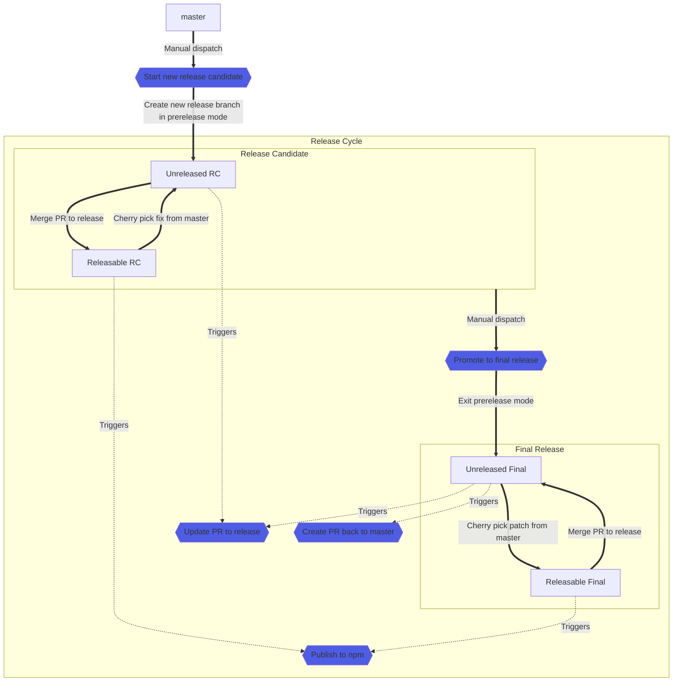

# Releasing

OpenZeppelin Contracts utilizes a fully [automated release process](#automation) to guarantee a safe and consistent release cycle. This process includes code building, packaging, and publishing, all of which are performed in a clean CI environment (Github Actions). This ensures that the code is not manually handled on a developer's personal machine, and instead is built, packaged, and published in a controlled environment. This helps to eliminate the potential for errors or inconsistencies that can occur when code is manually handled, and ensures that the release cycle is ongoing and reliable.

> Visit the documentation for [details about release schedule](https://docs.openzeppelin.com/contracts/releases-stability).

## Changesets

[Changesets](https://github.com/changesets/changesets/) is used as part as our release process for `CHANGELOG.md` management, so each change that's relevant for the codebase is expected to include a changeset entry, so it's eventually added to a release branch.

## Release branching model

The release schedule happens through a release branch called `release-vX.Y` for minor and major releases, and it's feature frozen. Each of these branches start as release candidates (rc) and eventually promoted to final.

Final releases can be updated with patch commits from `master` as well as released candidates, which are released again as a release candidate or patch increment depending on the state of the release branch.

Eg:
- Updates to a release candidate are published as `vX.Y.0-rc.Z`
- Updates to final releases are published as `vX.Y.Z`

The process is highlighted in the following diagram:

> **Note**
> The `changeset-release-*/release-vX.Y` branches happen in a single `changesets-release/release-vX.Y` branch, but they're all kept for informational purposes

### When is the library published?

We publish to NPM and Github Releases each time a release branch has no pending changesets and the version has been bumped using the [Changesets Action](https://github.com/changesets/action/). This is done in each highlighted commit in the `release-vX.Y` branch.

### Merging the release branch back

The release branch is merged back to master each time a final release is already published via an [automated Pull Request](scripts/release/workflow/prepare-release-merge.sh) that's reviewed by the OpenZeppelin maintainers. This means that if a new patch is cherry-picked from `master`, the new release patch will also be published and the release branch should be merged back again.

## Automation

The OpenZeppelin release cycle automation has been implemented as a [Github Actions state machine workflow](.github/workflows/release-cycle.yml) that runs for every change to a release branch, and it conforms to our [branching model](#release-branching-model).

### Jobs
The workflow uses different jobs and triggers for performing actions depending on the current state of the release branch. The list of jobs is the following:

- `state`: Is executed on every workflow run to determine which of the other steps are run. 
- `start`: Starts a new release branch with a release candidate from master.
- `promote`: Promotes a release branch from release candidate to final.
- `changesets`: Keeps the release Pull Request updated if there are pending changesets to merge.
- `publish`: Uploads the built package to `npm`. Its execution **requires approval from the maintainers.**
- `merge`: Creates a Pull Request to merge the release branch back each time a final release has been published.

The way the automation works is outlined in the diagram below (start from master):

> **Note**
> The boxes in blue correspond to one of the jobs listed before

