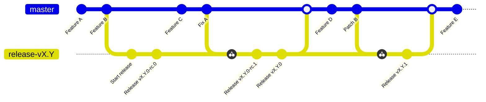

# Releasing

> Visit the documentation for [details about release schedule](https://docs.openzeppelin.com/contracts/releases-stability).

OpenZeppelin Contracts uses a fully automated release process that takes care of compiling, packaging, and publishing the library, all of which is carried out in a clean CI environment (GitHub Actions), implemented in the ([`release-cycle`](.github/workflows/release-cycle.yml)) workflow. This helps to reduce the potential for human error and inconsistencies, and ensures that the release process is ongoing and reliable.

## Changesets

[Changesets](https://github.com/changesets/changesets/) is used as part of our release process for `CHANGELOG.md` management. Each change that is relevant for the codebase is expected to include a changeset.

## Branching model

The release cycle happens on release branches called `release-vX.Y`. Each of these branches starts as a release candidate (rc) and is eventually promoted to final.

A release branch can be updated with cherry-picked patches from `master`, or may sometimes be committed to directly in the case of old releases. These commits will lead to a new release candidate or a patch increment depending on the state of the release branch.

